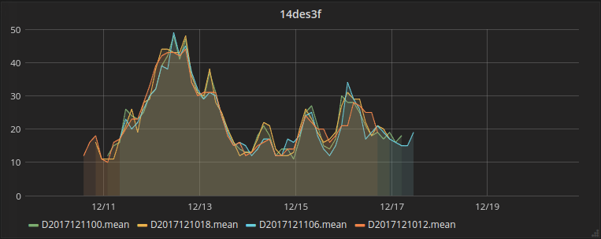

Work in progress

# grib2influx

cli tool to parse forecasts (or other sections) from grib-files to influx as timeseries

# Usage

 
    Usage of ./grib2influx:
      -database string
            Database name to use. (default "forecasts")
      -gribfile string
            Gribfile to import. If no gribfile specified, start server mode.
      -influxHost string
            Hostname for influxdb. (default "http://localhost")
      -influxPassword string
            Password for influx.
      -influxUser string
            User for influxdb.
      -influxport int
            Port for influxdb. (default 8086)
      -port int
            Server port no, if servermode. (default 8080)

## Testing and an example

To test the program locally you can use _docker-compose_. 

First, build the binary:

    $ make
    
Then start docker-compose:

    $ cd docker-compose && docker-compose up -d
    
Insert data from testdata grib-files:
     
    $ ./grib2influx  -gribfile testdata/gfs.t00z.pgrb2.2p50.f003
    $ ./grib2influx  -gribfile testdata/gfs.t00z.pgrb2.2p50.f006
    $ ./grib2influx  -gribfile testdata/gfs.t00z.pgrb2.2p50.f009
    $ ./grib2influx  -gribfile testdata/gfs.t00z.pgrb2.2p50.f012
    
Now, go to http://localhost:3000 and login with admin/admin. Add influx as a datasource(this step wil be obsolete when grafana officially adds support for adding datasources in docker) and start playing with your data:

    

# Detailed description

* parse the grib2-file using the griblib, a golang library to read grib2-files
* create points from the data and insert them into influx. 
   * series-name is the time of the forecast
   * values are added with the respective category name + coordinates

From one single grib-file you will end up with one series with as many values as categories in the grib-file(wind, temperature etc) multiplied with the number of coordinates: number_of_categories * number_of_coordinates

# Walkthrough

### fields from the grib-file 

* Forecasttime vs valuetime
  * forecasttime: Section1.ReferenceTime + Section1.ReferenceTimeSignificance
  * offset hour in filename for valuetime is used to calculate the valuetime of the gribfile data

* What kind of data is this anyway? Section0.Discipline + 
    Section4.ProductDefinitionTemplate.ParameterCategory
  * use griblib.ReadProductDisciplineParameters to resolve the name

* Calculating the coordinates of the data (Section3) is done manually

* insert 1 batch per message. 1 message contains typically 10 512 data points if the grid covers the whole planet. One file usually contains 77 messages.  